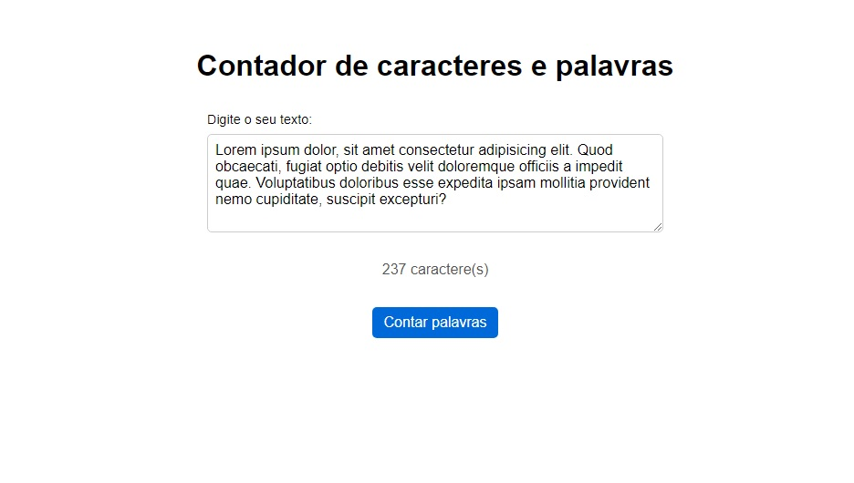

<h1 align="center">Contador de caracteres ou palavras</h1>

#Projeto feito para estudo de JavaScript puro, um contador de caracteres ou de palavras com um input para o usúario digitar ou colar uma frase e contar caractéres ou palavras nesta frase, com um botão para alternar entre os dois modos. 

|  <a href="#-tecnologias">Tecnologias</a>&nbsp;&nbsp;&nbsp;|&nbsp;&nbsp;&nbsp;

 

  

## 🚀 Tecnologias

Esse projeto foi desenvolvido com as seguintes tecnologias:

- HTML e CSS
- Git e Github
- JavaScript
---

Feito by Renato de Paula pelo curso Hora de Codar  